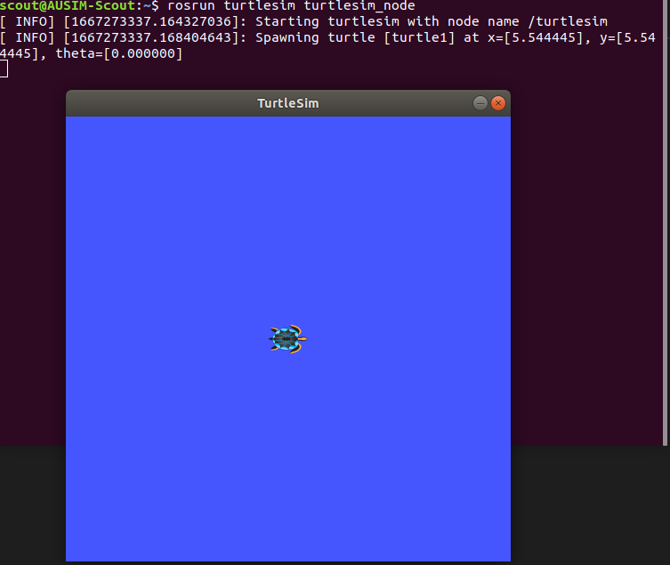

<!-- 本文档用Markdown文件格式编写，
参考网站：https://www.wenjiangs.com/doc/markdown-markdowncomment -->
# 环境搭建

## 一、Ubuntu1804安装
具体参考网络教程，参考链接:
[Ubuntu1804安装](https://blog.csdn.net/qq_40748967/article/details/122000473)<br>
由于使用的工控机里面内置了一个LVDS的芯片，所以开机不会直接显示在外接屏上面，可以使用`Win + P`调整显示输出，最后在设置里面更改即可 

---
## 二、Ubuntu配置
### (一)、配置镜像源
使用Ubuntu最好使用国内镜像源，以便下载软件时速度更快。具体步骤如下：
- 1.打开Ubuntu系统中的 __软件和更新__   
  

- 2.点击下载至后面的下拉框<br>
 

- 3.选择一个国内服务器，等待更新完毕 ，源切换完毕<br>
 

### (二)、源切换之后需要进行更新
 分别运行以下指令即可完成更新<br>
 `sudo apt update` :该命令用于更新软件列表<br>
 `sudo apt upgrade`:该指令用于安装更新<br>
有时候需要卸载不需要的包，运行`sudo apt autoremove`指令即可

### (三)、安装远程环境
- 1.安装ssh<br>
  输入指令`sudo apt install openssh-server`即可完成ssh安装，之后即可通过ssh连接Ubuntu系统

- 2.安装远程图形界面操作<br>
  远程桌面应用使用的是NoMachine,参考网站
  [Nomachine官方网站](https://www.nomachine.com/)(选择x86_64的dep包)
  - (1).下载并安装好linux版本的NoMachine之后，会在Linux自动上启动NoMachine服务器，只需要配置客户端即可。NoMachine客户端如图所示<br>
  

  - (2).打开客户端<br>
  

  - (3).点击Add，输入名称，服务器主机IP地址，端口4000，协议NX,如下图所示<br>
  

  - (4). 点击Add,会出现刚刚建立的连接，双击新建连接，<br>
  

  - (5).输入服务器用户名和密码即可成功建立远程桌面连接<br>
  
  
---
## 三、Ubuntu1804安装ROS(melodic)
Ubuntu1804对应的ROS版本为melodic，因此参考ROS官方文档:[melodic](https://wiki.ros.org/melodic/Installation/Ubuntu)。__注意:在安装过程中最好一条一条指令输入。__

### (一)配置源列表

`sudo sh -c 'echo "deb http://packages.ros.org/ros/ubuntu $(lsb_release -sc) main" > /etc/apt/sources.list.d/ros-latest.list'`

### (二)安装密钥

`sudo apt install curl`<br>
`curl -s https://raw.githubusercontent.com/ros/rosdistro/master/ros.asc | sudo apt-key add -`<br>
在输入上面第二条指令时，会出现如下错误：

<br>
解决方法:(参考文档[解决gpg报错](https://blog.csdn.net/jie030901106/article/details/116596637))
- 1.在[IPAddress](https://ipaddress.com/site/raw.githubusercontent.com)网站查找`https://raw.githubusercontent.com/ros/rosdistro/master/ros.asc`该链接的IP地址，查找结果如下：


- 2.修改hosts文件<br>
  输入`sudo vim /etc/hosts`<br>
  在IP地址后面增加一条`185.199.108.133 raw.githubusercontent.com`，如下图所示：<br>
  

  修改之后即可成功运行上面指令。

### (三)安装ROS

安装之前需要先对系统软件包列表进行更新<br>
运行指令:`sudo apt update`<br>
然后运行指令:`sudo apt install ros-melodic-desktop-full`<br>
即可安装完全版的ROS系统

### (四)设置环境变量

`echo "source /opt/ros/melodic/setup.bash" >> ~/.bashrc`<br>
`source ~/.bashrc`<br>
成功运行以上指令后，ROS系统安装完成。

### (五)ROS例程运行
检查ROS是否成功安装可以运行ROS自带的例程。
- 1.首先运行roscore，打开一个中断输入`roscore`如下图所示：<br>


- 2.再打开一个命令窗，输入`rosrun turtlesim turtlesim_node`,出现一个含有乌龟的窗口<br>


- 3.在在一个新的终端中输入`rosrun turtlesim turtle_teleop_key`,打开小乌龟控制节点，然后按下键盘上的上下左右箭头即可控制小乌龟的运动。<br>


上述例程成功运动后ROS安装成功。可以进行后续驱动移植和代码移植

---

## 四、IMU驱动移植
### (一)串口驱动安装
惯导使用的是串口进行通讯，因此需要先安装串口驱动，串口使用的是minicom<p>
- 1.输入`sudo apt install minicom`即可安装minicomo<br>
然后插上USB输入`ls /dev/tty*`会出现一个`/dev/ttyUSB0`的新增设备<br>


- 2.输入`sudo minicom -s`<br>
monicom配置界面选择`Serial port setup`选项如下图所示<br>


- 3.并且按照如下配置：`Serial Device`配置为`/dev/ttyUSB0`(和之前查找到的tty设备一致)<br>


- 4.配置完成之后保存并退出

- 5.如果再次打开出现下图所示内容，即安装串口驱动成功<br>
<br>
乱码问题是正常现象，需要后面解析数据

### (二)IMU惯导驱动移植
- 1.使用的惯导是[syd-dynamics](https://www.syd-dynamics.com/%e7%96%91%e9%97%ae%e8%a7%a3%e7%ad%94/)公司的TM353，点击链接会跳到疑问解答部分，相应的下载链接在如图所示的地方<br>


- 2.按照要求填写邮箱之后即可下载驱动代码，下载好的驱动并解压后的文件位置为<br>
/TransducerM_pkg<br>

- 3.将解压后的文件夹直接移动到自己建好的ROS工作空间中，编译即可运行。
- 4.官方的驱动没有解析IMU发来的陀螺仪和加速度数据，需要自己添加，在对应位置添加以下代码即可<br>
```C++
  msg_imu -> linear_acceleration.x = ep_Raw_GyroAccMag.acc[0];
  msg_imu -> linear_acceleration.y = ep_Raw_GyroAccMag.acc[1];
  msg_imu -> linear_acceleration.z = ep_Raw_GyroAccMag.acc[2];
  msg_imu -> angular_velocity.x = ep_Raw_GyroAccMag.gyro[0];
  msg_imu -> angular_velocity.y = ep_Raw_GyroAccMag.gyro[1];
  msg_imu -> angular_velocity.z = ep_Raw_GyroAccMag.gyro[2];
```
<br>

 <font color = "red">
- 5.官方所给的驱动无法满足100Hz的数据发送速度，主要原因在于处理串口接收到的数据需要一定时间，因此需要进一步修改驱动。目前解决方案是订阅串口发送的IMU数据，然后在另起一个话题接受并发布接收到的IMU数据。(目前存在问题需要解决)

</font>

---
## 五、雷达驱动移植
### (一)雷达接口配置
雷达使用的是Veldyne的16线雷达，需要通过网口进行通讯，具体配置如下：
- 1.工控机输入`ifconfig`指令，查看网卡配置<br>
<br>
上图所示的`eno1`和`enp1s0`是工控机的有线网卡:`eno1`用于工控机的上网连接； `enp1s0`用于连接雷达进行通讯使用

- 2.打开以太网有线设置<br>


- 3.点击选择`enpls0`网卡小齿轮按钮<br>


- 4.选择IPv4选项卡，设置为手动方式，地址，子网掩码，网关按照如图设置，注意地址一定要设置为`192.168.1.77`<br>


- 5.设置完毕之后插上雷达，使用`ping 192.168.1.201`指令查看是否连通到雷达,如果可以PING通,雷达即可使用<br>


---
### (二)雷达驱动移植
雷达驱动可以直接去Github官网下载，Velodyne雷达驱动Github地址：[https://github.com/ros-drivers/velodyne](https://github.com/ros-drivers/velodyne)

具体过程如下：<br>
- 1.创建一个ROS工作文件夹，并在文件夹里面创建一个`src`文件夹

- 2.进入`src`文件夹，将雷达驱动代码下载至该文件夹下

- 3.回到上一级目录，使用`catkin_make`指令进行编译,编译过程可能报错：<br>
<br>
输入`sudo apt install libpcap-dev`安装库文件

- 4.使用`source ./devel/setup.bash`指令更新当前端口环境变量

- 5.运行`roslaunch velodyne_pointcloud VLP16_points.launch`即可启动雷达扫描生成点云图

- 6.可以使用`rviz`订阅话题查看生成的点云(注意`Fixed Frame`修改为`velodyne`，然后添加话题`PointCloud2`)<br>


---

## 六、Hunter-se底盘驱动移植
底盘驱动移植参考文档:[/Documents/HUNTER SE用户手册](/Documents/HUNTERSE%20%E7%94%A8%E6%88%B7%E6%89%8B%E5%86%8C.pdf)<br>
具体移植过程如下:<br>
由于hunter-se底盘通讯接口为CAN总线，因此需要先安装CAN驱动。
### (一)CAN总线驱动安装
- 1.设置CAN-TO-USB适配器，使能gs_usb内核模块:`sudo modprobe gs_usb`

- 2.设置500k波特率和使能`can-to-usb`适配器:`sudo ip link set can0 up type can bitrate 500000`

- 3.使用`ifconfig -a`可以查看到can设备(can0即为接上的can设备)<br>


- 4.安装`can-utils`抓取`can`数据包，使用`sudo apt install can-utils`指令安装抓取工具，使用`candump can0`指令来抓取数据包(出现如图所示数据can驱动安装完成)<br>


### (二)底盘驱动移植
- 1.下载ROS依赖包<br>
`sudo apt install libasio-dev`<br>
`sudo apt install ros-mekodic-teleop-twist-keyboard`

- 2.克隆编译hunter_2_ros源码<br>
```
cd ~/catkin_ws/src
git clone --recursive https://github.com/agilexrobotics/ugv_sdk.git
git clone https://github.com/agilexrobotics/h## 七、双天线版卡
- 1.连接4G模块、连接双天线，确定控制器供电正常（接线有接触不良的情况，没亮蓝灯即未供电）

- 2.在nas中下载驱动包[test_rtk_ws]修改串口并编译<br>
串口写在/test_rtk_ws/src/uart_rtk_driver/config/config.yaml中
```
cd ~/test_rtk_ws/
catkin_make
```
- 3.启动ROS节点<br>
启动ROS MASTER<br>
`roscore`<br>
设置串口权限<br>
`sudo chmod 777 /dev/ttyUSB*`<br>
启动rtk_driver_node<br>
`rosrun uart_rtk_driver rtk_driver_node`<br>
接受自定义topic<br>
`rostopic echo /rtk_data`<br>
或者<br>
`rostopic echo /rtk_yaw_data`unter_ros.git
cd ..
catkin_make
```

- 3.启动ROS节点
启动基础节点<br>
`roslaunch hunter_bringup hunter_robot_base.launch`<br>
启动键盘远程操作节点<br>
`roslaunch hunter_bringup hunter_teleop_key-board.launch`<br>
启动键盘节点后即可按照提示进行对小车的控制。


## 七、双天线版卡
- 1.连接4G模块、连接双天线，确定控制器供电正常（接线有接触不良的情况，没亮蓝灯即未供电）

- 2.在nas中下载驱动包[test_rtk_ws]修改串口并编译<br>
串口写在/test_rtk_ws/src/uart_rtk_driver/config/config.yaml中
```
cd ~/test_rtk_ws/
catkin_make
```
- 3.启动ROS节点<br>
启动ROS MASTER<br>
`roscore`<br>
设置串口权限<br>
`sudo chmod 777 /dev/ttyUSB*`<br>
启动rtk_driver_node<br>
`rosrun uart_rtk_driver rtk_driver_node`<br>
接受自定义topic<br>
`rostopic echo /rtk_data`<br>
或者<br>
`rostopic echo /rtk_yaw_data`


